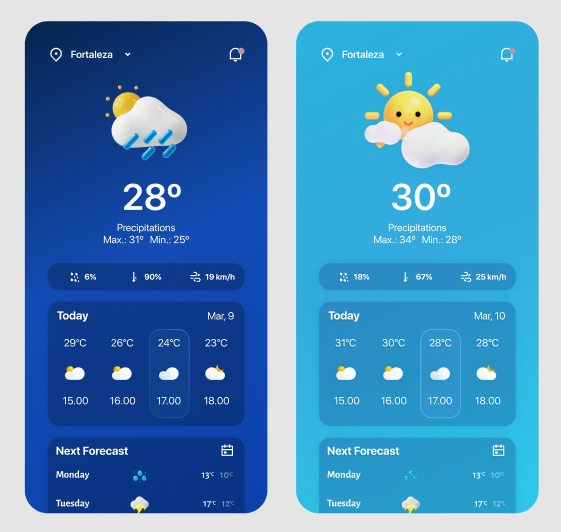
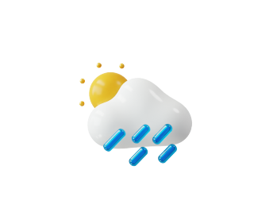

# APP Weather

 O projeto a seguir tem a finalidade de criar um app que exibe informações do clima na cidade de São Paulo.
 Conta com uma tela que dependendo do clima e do horário mudará o icone que representa o clima e a cor.
 Para climas mais chuvosos o app assume uma cor mais escura e para dias mais ensolarados cor mais clara.

As telas do APP estão seguindo os padrões estipulados da imagem a seguir:

Porém, para deixar os estados climatologicos mais completo foi adicionado as imagens:

  

## Instruções

Para realizar o build do App deverá ter as seguintes ferramentas 
[NodeJS](https://nodejs.org/en), 
[GIT](https://git-scm.com/)
e o Editor de codígo de sua preferencia.

ao realizar o clone do projeto, você deverá informar os seguintes comandos no **GIT**

os comandos a seguir criará uma pasta chamada Weather, entrará nela e clonará o repositório

- $ mkdir Weather
- $ cd Weather
- $ git clone (link do projeto)

A partir do momento que o projeto está em sua máquina você deverá realizar os seguintes comandos:

- $ cd mobile-weather-app
- $ npm install ou yarn (caso o [yarn](https://yarnpkg.com/) esteja instalado no seu pc)

os comandos acima fará você entrar na pasta do repositório e instalar as dependencias do projeto.

Ao final da instalação das dependências usuários de Android deverão realizar o seguinte comando:

- $ npx react-native run-android

Os usuários de IOS deverão realizar os seguintes comandos e o PC deverá ser um macBook:

- $ cd ios
- $ pod install
- $ npm run ios

lembre-se, para rodar o projeto o celular deve estar conectado ao pc, ou deverá ter o emulador instalado.
